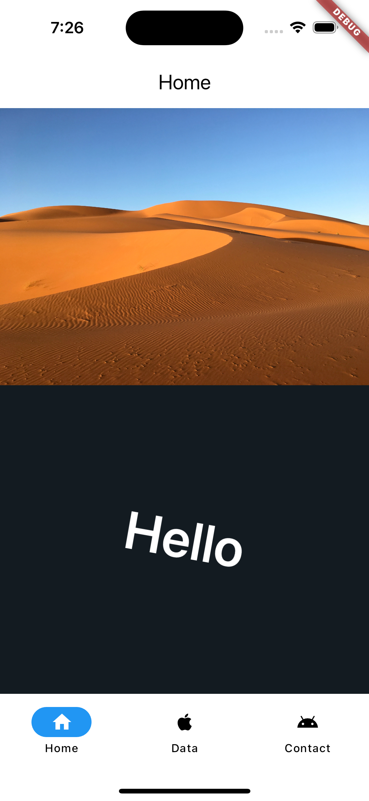
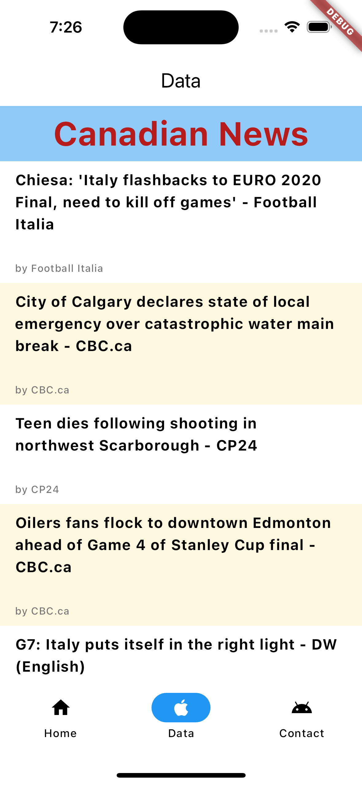
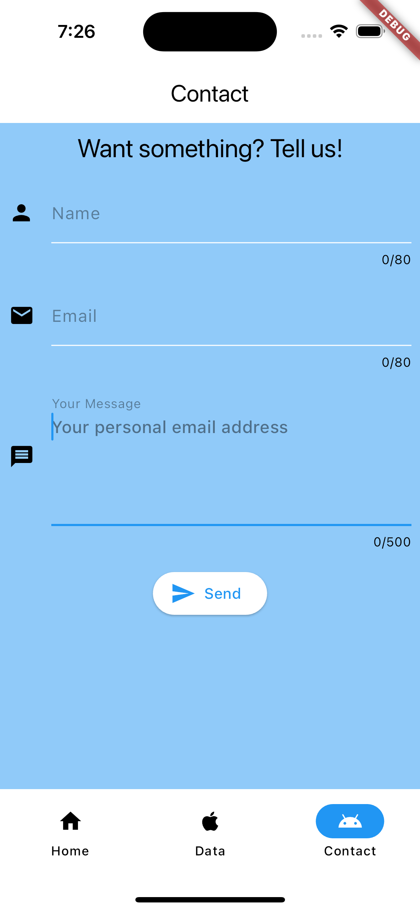

# MAD9135 - Flutter Assignment #2

## Description

Link to the assignment page: https://mad9135.github.io/f2023/deliverables/assign.html#_4-flutter-navigation-app

This is a simple Flutter app with following features

- Navigation (3 tabs: Home, Data and Contact)
- Home screen to feature a static image and a transformed text
- Data screen fetch data across the internet and display them in a list view
- Contact us screen featuring TextEditingController

## Images

### Home Screen

### Data Screen

### Contact Screen

